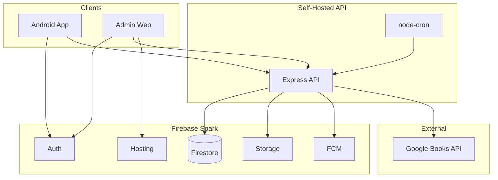

# Architecture

## Final Stack

- Mobile app: Expo + React Native + TypeScript
- Admin panel: React + TypeScript
- API: Express + TypeScript + Firebase Admin SDK
- Database: Firestore
- File storage: Firebase Storage
- Authentication: Firebase Auth
- Notifications: Firebase Cloud Messaging
- Scheduled jobs: `node-cron`

## High-Level Design

## User Roles

### Student

- Browse physical and digital books
- Search by title, author, and ISBN
- Borrow and return via QR scanning
- Reserve unavailable physical titles
- Read and download PDFs
- Track personal bookshelf progress and ratings

### Librarian

- Add books by ISBN or manual metadata
- Add physical copies and generate QR codes
- Reprint QR codes
- Upload PDFs
- Mark fines as paid
- Mark copies as damaged
- View reports and reservation queues

### Admin

- All librarian permissions
- Promote students to librarians
- Suspend or deactivate accounts
- Manage global configuration
- Manage holidays
- View audit and reporting data

## Core Modules

### Authentication and RBAC

- Firebase Auth handles sign up and sign in
- New users register as students by default
- Admin upgrades eligible users to librarian

### Physical Library

- Catalog is stored at title level
- Each physical copy has its own QR code and status
- Borrow and return flows are enforced on the API

### Reservations

- FIFO reservation queue by ISBN
- 72-hour hold window once a reserved copy becomes available
- Expiry job runs every 6 hours while the API is running

### Digital Library

- PDF files are stored in Firebase Storage
- Metadata is stored in Firestore
- Students manage progress and ratings from bookshelf records

### Notifications

- Due reminders at 2 days and 1 day before due date
- Overdue and reservation-ready alerts via FCM

### Reporting

- Daily and range-based report views
- CSV/Excel and PDF export from the admin web

## Operational Constraints

- The API is self-hosted on the developer's machine for MVP and demos
- Scheduled jobs only run while the API process is running
- Remote testers require a tunnel such as `ngrok`
- Android is the only target platform for phase 1
